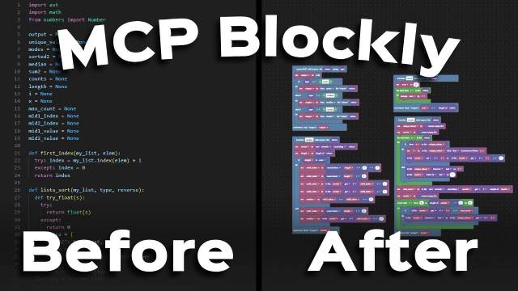

# MCP Blockly

MCP Blockly is a visual programming environment for building real MCP servers without dealing with Python syntax or configuration. It brings the clarity of block-based logic into AI development, allowing newcomers and experienced builders alike to design, test, and refine MCP tools through a clean drag-and-connect workflow. Every block you place generates runnable Python code instantly, so you can focus on structure and behavior while the system manages the boilerplate.

## YouTube Video (click on image)

[](https://www.youtube.com/watch?v=5oj-2uIZpb0)

## What This Does

MCP Blockly lets you build Model Context Protocol (MCP) servers using a block-based interface, perfect for students and newcomers stepping into AI development. The core building happens on the visual canvas. You define your MCP inputs, arrange your logic with blocks, and choose what your server will return. Every change you make is reflected in live Python code on the side. The generator handles function signatures and MCP boilerplate automatically, so you never have to worry about syntax or configuration. Everything stays valid and synchronized.

The interface has three main areas. The canvas on the left is where you build by dragging and connecting blocks. On the right are two tabs for working with your project: the Testing tab, and an AI Assistant tab.

Once your blocks are in place, the Development panel makes testing simple. It automatically generates input fields based on your parameters, so you can run the MCP server logic instantly. You enter values, submit, and see the outputs appear. This kind of immediate feedback helps learners understand how data flows through their tool and builds intuition about how AI tools work.

The AI Assistant tab lets you build and refine your project through conversation. It understands your workspace and becomes a natural part of how you learn and explore the MCP ecosystem.

The assistant can:
- Create new blocks from plain language. Describe what you want to accomplish, and it builds the correct structure automatically.  
- Delete or replace existing blocks without disrupting the rest of your layout.  
- Create and name variables that become immediately usable in your workspace.  
- Run your MCP tool with real inputs and show the actual outputs for testing.  
- Build nested block structures, such as inserting expressions or operations inside other blocks.  
- Explain concepts and guide you step by step through the creation process.  
- Perform multi-step changes and executions, refining your setup one step at a time.  

It works live and responds quickly, keeping your workspace synchronized with every instruction. This combination of hands-on building with conversational guidance bridges the gap between visual coding and real AI workflows. Taking things one step at a time leads to more accurate and reliable results as you learn.

The File menu handles creating new projects, opening existing ones, and downloading your work. You can download just the generated Python code or the entire project as a JSON file. The Edit menu provides standard undo, redo, and a cleanup button to reorganize blocks. The Examples menu includes pre-built projects you can load to understand how to structure your own.

### API Keys

The system has two optional but recommended API keys:

- **OpenAI API Key**: Enables the AI Assistant: your guide through the learning process. The assistant helps you build blocks, fix mistakes, explain concepts, and explore MCP development interactively. Without it, you can still create and test blocks manually.
- **Hugging Face API Key**: Allows you to deploy your MCP as a real, live server on Hugging Face Spaces. This is a practical way to learn how AI tools work in production. The system creates a new Space and uploads your tool automatically. The Space becomes a real MCP server that other AI systems can connect to and call natively. Without it, you can build and test locally but won't be able to deploy unless you manually create a space and upload the generated `app.py` file.

Set these keys through Settings before using features that depend on them. Both are optional: you can build and test tools without either key, but certain features won't be available.

The toolbox contains blocks for common operations: calling language models, making HTTP requests, extracting data from JSON, manipulating text, performing math, and working with lists. You connect these blocks to build your workflow.

## Installation

Clone the repository and install dependencies.

```bash
git clone https://github.com/owenkaplinsky/mcp-blockly.git
cd mcp-blockly/project
pip install -r ../requirements.txt
npm install
```

## Running Locally

Start the application with:

```bash
npm start
```

After that, it will open a tab in your browser and you can start building!

## How It Works

The core mechanism is a recursive Python code generator. When you connect blocks, the system walks through your structure and compiles it into Python code. Text blocks produce string literals, math operations produce arithmetic expressions, conditionals produce if/elif/else branches, and loops produce iteration logic. Your top-level MCP block becomes a function with typed parameters and return values.

Code generation happens on every change: you adjust a block, and the Python code regenerates instantly. The system identifies which blocks are inputs (connected to your MCP parameters), which are logic (the code body), and which are outputs (what gets returned). It tracks connections at a low level, so when you plug one block's output into another block's input slot, that relationship gets baked into the generated code automatically. Variables follow the same pattern: create a variable, and it becomes available as a value block you can plug in anywhere.

The generated code gets sent to a backend service that handles local testing and execution. This backend also spins up a Gradio interface: it parses your function signature, sees what types your parameters are, and generates input fields accordingly. When you submit values from the Testing tab, the code executes with those inputs and displays the results.

The second backend is the AI system. It reads your workspace in a domain-specific language: each block gets a unique ID marked with special delimiters, and its structure is described as nested function calls. For example, a text block might look like `↿ abc123 ↾ text(inputs(TEXT: "hello"))`, telling the AI what the block does and how it's configured. When you send a message, the AI receives your entire workspace in this format as context. It understands what operations are possible: it can construct new blocks described in the same nested syntax, request existing blocks be deleted by their ID, create variables, and more. These requests come back to your browser as instructions, which are executed immediately to update the visual workspace.

Behind the scenes, the AI uses block IDs to identify exactly which blocks to target. It describes the structure it wants using nested block syntax, then sends that back. Your browser receives these instructions through Server-Sent Events, creates or deletes blocks live, and regenerates the code.

When deployment happens, the latest generated Python code is packaged with its dependencies and uploaded to Hugging Face Spaces. The system waits for the space to build (typically 1-2 minutes), then registers it as a live MCP server. From that point, the AI can call your deployed MCP directly with real data, getting results from the production version rather than the local one.

All of this runs through one unified web interface. The frontend communicates with both backends over HTTP for regular operations and Server-Sent Events for real-time AI updates. Your API keys are stored in memory and used to authenticate requests to OpenAI and Hugging Face during your session.
